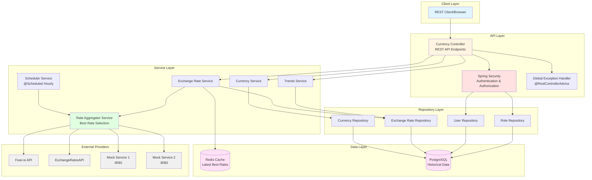
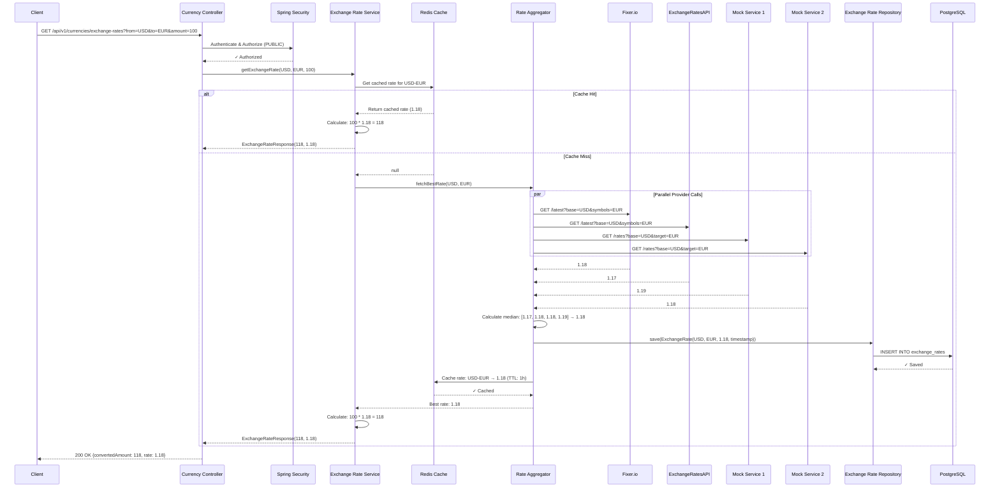
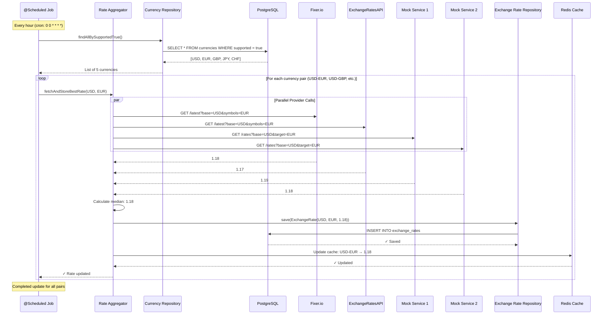
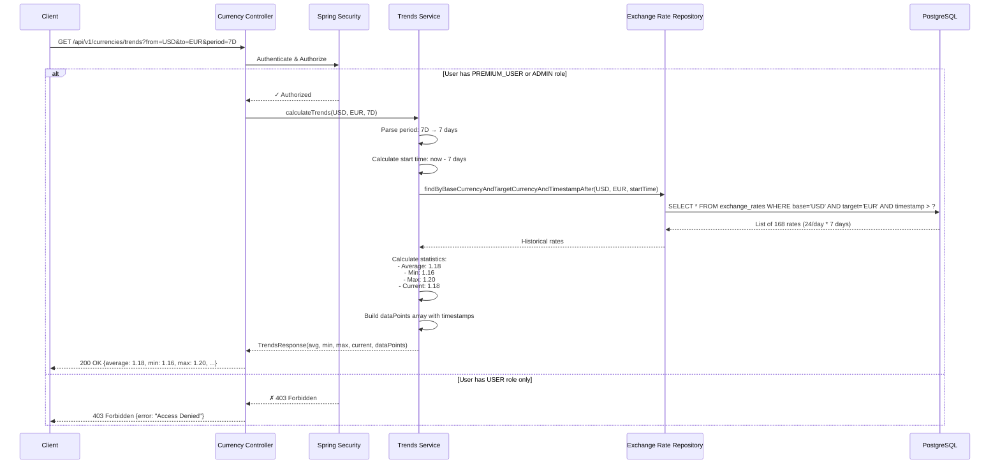
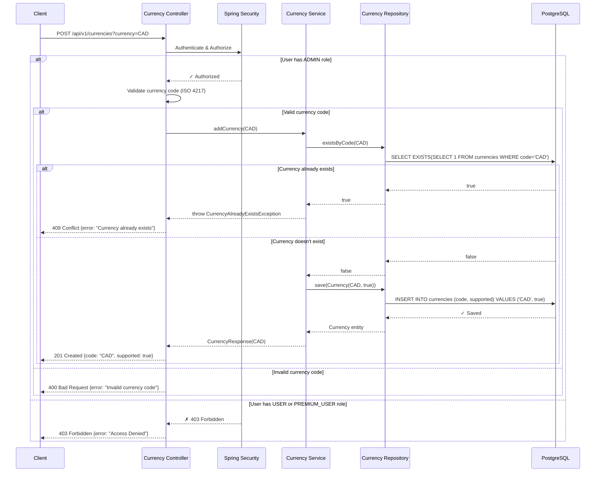

# Currency Exchange Rates Provider Service

Spring Boot 3.5 service that aggregates exchange rates from multiple providers (real external APIs + mock services), stores best rates in PostgreSQL with Redis caching, and exposes a REST API with role-based access control.

## Features

- **Multi-Provider Aggregation**: Fetches rates from 2+ external APIs and 2 Docker mock services
- **Best Rate Selection**: Compares rates from all providers and selects the median to avoid outliers
- **Dual Storage**: PostgreSQL for historical data + Redis for hot cache
- **Scheduled Updates**: Automatic rate fetching every hour + on startup
- **Role-Based Security**: Three user roles (USER, PREMIUM_USER, ADMIN) with different access levels
- **RESTful API**: Clean REST endpoints with OpenAPI/Swagger documentation
- **Dockerized**: Full Docker Compose setup for easy deployment

## Technology Stack

- **Java 21** with Spring Boot 3.5.0
- **Spring Framework 6.2.x**
- **Spring Security 6.5.0** with BCrypt password encryption
- **PostgreSQL 16** with Liquibase migrations
- **Redis 7** for caching
- **Maven 3.9** for build
- **Lombok** for boilerplate reduction
- **OpenAPI 3 / Swagger UI** for API documentation
- **Docker & Docker Compose** for containerization

## Architecture Diagram



### Architecture Overview

**Key Components:**
- **Controllers**: Handle HTTP requests, validation, and security
- **Services**: Business logic for currency management, rate aggregation, trends calculation, and scheduling
- **Providers**: Abstraction layer for external rate sources (2 real APIs + 2 mock services)
- **Repositories**: Spring Data JPA for database operations
- **Dual Storage**: Redis for fast cache access, PostgreSQL for persistence
- **Scheduled Jobs**: Automatic rate updates every hour using @Scheduled

**Data Flow:**
1. Scheduler triggers hourly rate fetch OR user calls refresh endpoint
2. Aggregator Service fetches rates from all 4 providers in parallel
3. Best rate selected using median algorithm (avoids outliers)
4. Rates stored in PostgreSQL (historical) and Redis (cache)
5. API requests check Redis first, fallback to PostgreSQL if needed

## Sequence Diagrams

### Exchange Rate Request Flow



### Scheduled Rate Update Flow



### Trends Analysis Flow (PREMIUM_USER)



### Currency Addition Flow (ADMIN only)



## Project Structure

```
currency_exchange_rates_provider_service/
├── src/main/java/com/exchange/currency/
│   ├── config/              # Security, Redis, OpenAPI, RestClient configs
│   ├── controller/          # REST controllers + global exception handler
│   ├── dto/                 # Request/Response DTOs with validation
│   ├── entity/              # JPA entities (Currency, ExchangeRate, User, Role)
│   ├── exception/           # Custom exceptions
│   ├── provider/            # External API provider implementations
│   ├── repository/          # Spring Data JPA repositories
│   └── service/             # Business logic services
├── src/main/resources/
│   ├── db/changelog/        # Liquibase database migrations
│   └── application.yml      # Application configuration
├── mock-services/
│   ├── mock-service-1/      # Standalone Spring Boot mock service 1
│   └── mock-service-2/      # Standalone Spring Boot mock service 2
├── Dockerfile               # Main app Docker image
├── docker-compose.yml       # Orchestration for all services
└── pom.xml                  # Maven dependencies

```

## Quick Start

### Prerequisites

- **Docker** and **Docker Compose** installed
- (Optional) **Java 21** and **Maven 3.9** for local development
- (Optional) API keys for fixer.io or exchangeratesapi.io (mock services work without them)

### Run with Docker Compose

```bash
# Clone the repository
git clone <repository-url>
cd currency_exchange_rates_provider_service

# Start all services (app, PostgreSQL, Redis, 2 mock services)
docker-compose up --build

# Access the application
# API: http://localhost:8080
# Swagger UI: http://localhost:8080/swagger-ui.html
# Mock Service 1: http://localhost:8081/rates?base=USD
# Mock Service 2: http://localhost:8082/rates?base=EUR
```

### Run Locally (Development)

```bash
# 1. Start PostgreSQL and Redis with Docker
docker-compose up postgres redis

# 2. Start mock services (in separate terminals)
cd mock-services/mock-service-1
mvn spring-boot:run

cd mock-services/mock-service-2
mvn spring-boot:run

# 3. Run main application
cd ../..
mvn spring-boot:run
```

## API Endpoints

### Public Endpoints

#### Get All Currencies
```http
GET /api/v1/currencies
```

**Response:**
```json
[
  {"code": "USD", "name": "US Dollar"},
  {"code": "EUR", "name": "Euro"}
]
```

#### Calculate Exchange Rate
```http
GET /api/v1/currencies/exchange-rates?amount=100&from=USD&to=EUR
```

**Response:**
```json
{
  "amount": 100,
  "from": "USD",
  "to": "EUR",
  "rate": 0.92,
  "result": 92.00
}
```

### Admin-Only Endpoints

#### Add Currency
```http
POST /api/v1/currencies?currency=USD

Authorization: Basic admin:admin123
```

**Response:** `201 Created`

#### Refresh Exchange Rates
```http
POST /api/v1/currencies/refresh

Authorization: Basic admin:admin123
```

**Response:**
```json
"Exchange rates refresh initiated"
```

### Admin + Premium User Endpoints

#### Get Trends
```http
GET /api/v1/currencies/trends?from=USD&to=EUR&period=12H

Authorization: Basic premium:premium123
```

**Response:**
```json
{
  "from": "USD",
  "to": "EUR",
  "period": "12H",
  "startRate": 0.91,
  "endRate": 0.92,
  "change": 0.01,
  "changePercent": 1.10,
  "dataPoints": [...]
}
```

## User Roles and Credentials

| Username | Password     | Role          | Access                          |
|----------|--------------|---------------|---------------------------------|
| admin    | admin123     | ADMIN         | All endpoints                   |
| premium  | premium123   | PREMIUM_USER  | Public + trends                 |
| user     | user123      | USER          | Public only                     |

Passwords are BCrypt-hashed in the database via Liquibase migrations.

## Configuration

### Environment Variables

Configure via environment variables or `application.yml`:

| Variable                       | Default                                      | Description                          |
|--------------------------------|----------------------------------------------|--------------------------------------|
| `DATABASE_URL`                 | `jdbc:postgresql://localhost:5432/...`       | PostgreSQL connection string         |
| `DATABASE_USERNAME`            | `postgres`                                   | Database username                    |
| `DATABASE_PASSWORD`            | `postgres`                                   | Database password                    |
| `REDIS_HOST`                   | `localhost`                                  | Redis host                           |
| `REDIS_PORT`                   | `6379`                                       | Redis port                           |
| `FIXER_ENABLED`                | `false`                                      | Enable fixer.io provider             |
| `FIXER_API_KEY`                | (empty)                                      | Fixer.io API key                     |
| `EXCHANGERATESAPI_ENABLED`     | `false`                                      | Enable exchangeratesapi.io provider  |
| `EXCHANGERATESAPI_API_KEY`     | (empty)                                      | ExchangeRatesAPI key                 |
| `MOCK1_ENABLED`                | `true`                                       | Enable mock service 1                |
| `MOCK1_URL`                    | `http://localhost:8081`                      | Mock service 1 URL                   |
| `MOCK2_ENABLED`                | `true`                                       | Enable mock service 2                |
| `MOCK2_URL`                    | `http://localhost:8082`                      | Mock service 2 URL                   |
| `RATE_UPDATE_CRON`             | `0 0 * * * *` (every hour)                   | Cron expression for rate updates     |

### External API Keys

To use real external APIs instead of mocks:

1. Get API keys from:
   - [fixer.io](https://fixer.io/)
   - [exchangeratesapi.io](https://exchangeratesapi.io/)

2. Set environment variables:
   ```bash
   FIXER_ENABLED=true
   FIXER_API_KEY=your_key_here
   EXCHANGERATESAPI_ENABLED=true
   EXCHANGERATESAPI_API_KEY=your_key_here
   ```

## Database Schema

### Tables

- **currencies**: Supported currency codes (USD, EUR, etc.)
- **exchange_rates**: Historical rates with provider info and timestamps
- **users**: User accounts with encrypted passwords
- **roles**: USER, PREMIUM_USER, ADMIN
- **user_roles**: Many-to-many relationship

Managed by Liquibase migrations in `src/main/resources/db/changelog/`.

## Development

### Build

```bash
mvn clean install
```

### Run Tests

```bash
mvn test
```

### Code Quality

```bash
# Checkstyle
mvn checkstyle:check

# PMD
mvn pmd:check

# Code coverage (Jacoco)
mvn jacoco:report
# Open target/site/jacoco/index.html
```

### Swagger UI

Access API documentation at: http://localhost:8080/swagger-ui.html

## Architecture

```
┌─────────────────┐
│   REST Client   │
└────────┬────────┘
         │
         ▼
┌─────────────────────────────────────┐
│      Spring Security                │
│  (Role-Based Access Control)        │
└────────┬────────────────────────────┘
         │
         ▼
┌─────────────────────────────────────┐
│      REST Controllers               │
│  (CurrencyController)               │
└────────┬────────────────────────────┘
         │
         ▼
┌─────────────────────────────────────┐
│      Service Layer                  │
│  - CurrencyService                  │
│  - ExchangeRateService              │
│  - ExchangeRateAggregatorService    │
│  - ExchangeRateSchedulerService     │
│  - TrendsService                    │
└────────┬────────────────────────────┘
         │
         ├────────────────────┬──────────────────┐
         ▼                    ▼                  ▼
┌────────────────┐  ┌──────────────────┐  ┌──────────────┐
│  PostgreSQL    │  │   Redis Cache    │  │  Providers   │
│  (Liquibase)   │  │                  │  │  - Fixer.io  │
└────────────────┘  └──────────────────┘  │  - ExchAPI   │
                                          │  - Mock 1    │
                                          │  - Mock 2    │
                                          └──────────────┘
```

## Key Design Patterns

- **Repository Pattern**: Spring Data JPA repositories
- **Service Layer**: Business logic separation
- **DTO Pattern**: Request/Response DTOs separate from entities
- **Provider Pattern**: Pluggable exchange rate providers
- **Strategy Pattern**: Best rate selection algorithm
- **Cache-Aside**: Redis caching with database fallback

## Monitoring and Health

- **Health Check**: `/actuator/health`
- **Prometheus Metrics**: `/actuator/prometheus` (if enabled)
- **Logs**: Configurable via `logging.level` in `application.yml`

## Troubleshooting

### Database Connection Issues
```bash
# Check PostgreSQL is running
docker-compose ps postgres

# View logs
docker-compose logs postgres
```

### Redis Connection Issues
```bash
# Check Redis is running
docker-compose ps redis

# Test connection
docker exec -it currency-redis redis-cli ping
```

### Mock Services Not Responding
```bash
# Check services are up
docker-compose ps

# Test mock service 1
curl http://localhost:8081/health

# Test mock service 2
curl http://localhost:8082/health
```

### Rate Updates Not Working
```bash
# Check logs for scheduler
docker-compose logs currency-app | grep "Scheduled exchange rate fetch"

# Manually trigger refresh
curl -X POST -u admin:admin123 http://localhost:8080/api/v1/currencies/refresh
```

## Contributing

1. Fork the repository
2. Create a feature branch (`git checkout -b feature/amazing-feature`)
3. Commit your changes (`git commit -m 'Add amazing feature'`)
4. Push to the branch (`git push origin feature/amazing-feature`)
5. Open a Pull Request

## License

This project is licensed under the MIT License.

## Contact

For questions or support, please open an issue in the GitHub repository.
